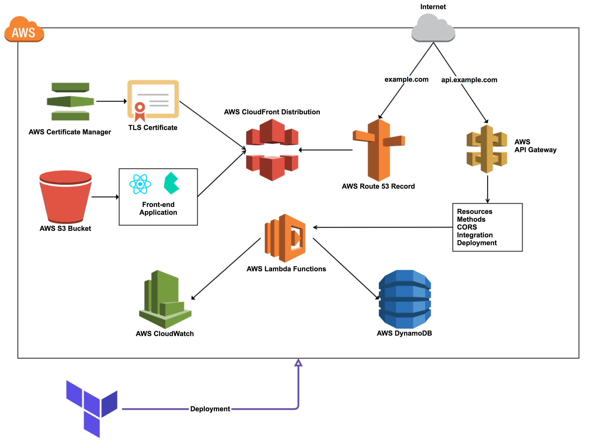

[![Build Status][workflow-image]][workflow-url]

# Serverless

This is a simple web application and API server built using serverless architecture.

## Architecture



## Prerequisites

In your local development environment, you need the following tools available in your path:

  - [Yarn](https://yarnpkg.com) (`yarn`)
  - [AWS CLI](https://aws.amazon.com/cli) (`aws`)
  - [Terraform](https://www.terraform.io) (`terraform`)
  - [Serverless Framework](https://serverless.com) (`serverless`)

## Terraform

You can deploy a fully functional web application with serverless APIs and distribute it using [CloudFront](https://aws.amazon.com/cloudfront).

## Serverless Framework

You can deploy the serverless APIs and client application using [Serverless](https://serverless.com) framework.

### Options

| Option        | Default     | Description       |
|---------------|-------------|-------------------|
| `profile`     |             | aws cli profile   |
| `environment` | `dev`       | environment name  |
| `region`      | `us-east-1` | deployment region |

### Commands:

You can deploy the resources as follows:

```bash
yarn run client
yarn run deploy
yarn run deploy-client
```

You can also remove the resources as follows:

```bash
yarn run remove
yarn run remove-client
```


[workflow-url]: https://github.com/moorara/serverless-demo/actions
[workflow-image]: https://github.com/moorara/serverless-demo/workflows/Main/badge.svg
